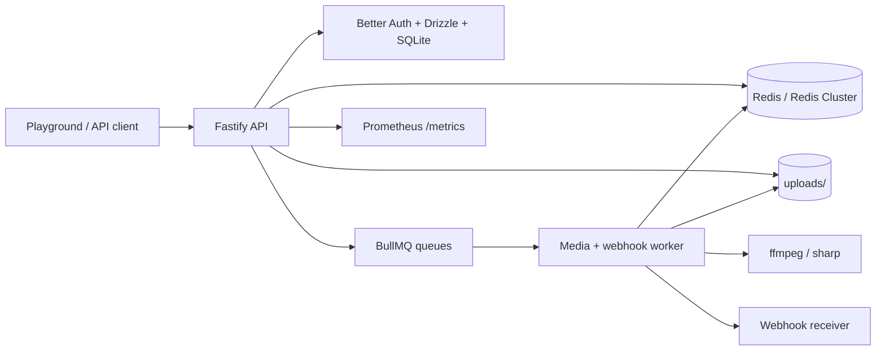
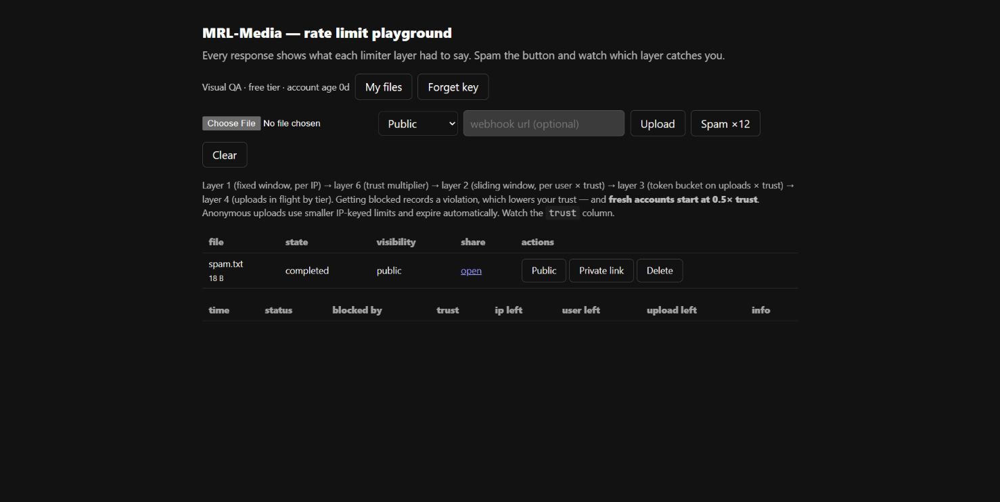

<div align="center">
  <br />
  <div>
    
    
    
    
    
    
  </div>

  <h3 align="center">MRL-Media <br /> Distributed Rate Limiter + Media Worker</h3>

  <div align="center">
    Media upload API built to make six rate-limiting algorithms real:
    Authenticated uploads, worker slots, webhook pacing, adaptive trust,
    Redis Lua atomicity, and local scale / chaos proof.
  </div>
</div>

## 🍁 Overview

MRL-Media is a project that has an impact while helping me learn six different rate limiting algorithms and how to use them with Redis.

## 💻 Technologies

[](https://nodejs.org/ "Node.js")
[](https://www.typescriptlang.org/ "TypeScript")
[](https://redis.io/ "Redis")
[](https://www.sqlite.org/ "SQLite")
[](https://www.docker.com/ "Docker")

- **Language**: TypeScript
- **API**: Fastify 5, Multipart streaming uploads
- **Auth**: `better-auth` email & password + API keys, Drizzle schema, SQLite WAL
- **Rate limiting**: Redis + Lua for fixed window, sliding window, token bucket, semaphore, GCRA, and violation tracking
- **Workers**: BullMQ queues for media processing and webhook delivery
- **Media**: sharp for image derivatives, ffmpeg for video poster/web mp4 output
- **Observability**: Prometheus `/metrics`, worker heartbeat, queue depth gauges
- **Proof tooling**: Vitest, Artillery, Redis Cluster smoke, chaos script, Docker Compose replica smoke

## 🚀 Features

### Rate Limiting Engine

- 🧱 **Layer 1: Fixed window per IP** for cheap high-cardinality coarse protection.
- 🌊 **Layer 2: Sliding window per user** for smoother authenticated traffic limits.
- 🪣 **Layer 3: Token bucket on uploads** for bursty media actions.
- 🚦 **Layer 4: Concurrency semaphore** for uploads in flight and transcode slots.
- ⏱️ **Layer 5: GCRA webhook pacing** so receivers get spaced delivery, not clumps.
- 🧠 **Layer 6: Adaptive trust multiplier** based on account age, recent violations, and global queue depth.
- 🧪 **Exact ZSET sliding-window variant** with a divergence test against the weighted approximation.
- 🔍 **Read-only token-bucket `peek()`** and semaphore `extend()` for long-running holder heartbeats.

### Auth, Files, and Media

- 🔐 **Better Auth email/password signup** with API key creation.
- 🔑 **Bearer or `x-api-key` authentication** for API clients.
- 🗃️ **Drizzle-managed auth schema** plus app-owned file rows.
- 🧾 **Owner-only file access**: strangers get 404, anonymous users get 401.
- 🖼️ **Image derivatives**: thumbnail and web-optimized webp outputs.
- 🎞️ **Video derivatives**: poster thumbnail plus web mp4 output through ffmpeg.
- 🧯 **SSRF guard** for webhook URLs with DNS resolution and private-address blocking.

### Worker and Webhook Pipeline

- 📬 **BullMQ transcode queue** for media jobs.
- 🧷 **Tiered worker slots**: free/pro users get different transcode concurrency.
- 🔁 **Webhook retry path** with exponential backoff for HTTP failures.
- 📏 **GCRA pacing** delays webhook jobs to the exact `retryAt` timestamp.
- 💓 **Worker heartbeat** exposed through `/health`.
- 🔥 **Cold-start warmup** checks Redis, sharp, and ffmpeg before claiming worker readiness.

### Proof and Operations

- 📊 **Prometheus metrics** for limiter decisions, queue depth, and worker heartbeat age.
- 🧬 **Redis Cluster-safe keys** using hash tags so Lua scripts stay in one slot.
- 🧨 **Chaos script** that proves worker death/restart visibility and Redis fail-closed behavior.
- ⚖️ **Distributed correctness script** proving shared Redis state across API instances.
- 📈 **Load, soak, Artillery, and local fixed-arrival scale checks** for laptop-scale regression proof.
- 🐳 **Docker Compose replica smoke** with nginx + configurable API replicas.

## 🏗️ Architecture



## 🧪 The Six Layers

| #   | Algorithm             | Surface                | Why it belongs there                                           |
| --- | --------------------- | ---------------------- | -------------------------------------------------------------- |
| 1   | Fixed window          | Per-IP, all routes     | Cheapest possible coarse wall for huge anonymous cardinality   |
| 2   | Sliding window        | Per authenticated user | Smooths authenticated request volume without boundary bursts   |
| 3   | Token bucket          | Upload initiation      | Allows album-dump bursts while enforcing sustained upload rate |
| 4   | Concurrency semaphore | Uploads + transcodes   | Limits scarce simultaneous resources: sockets, disk, CPU, RAM  |
| 5   | GCRA                  | Webhook egress         | Guarantees spacing between deliveries to the same receiver     |
| 6   | Adaptive multiplier   | Layers 2-4             | Scales limits by account trust, violations, and global load    |

## 🤝 Usage

### Playground

1. Start Redis, the API, and the worker.
2. Open [http://localhost:3000](http://localhost:3000).
3. Sign up with email/password; the page stores an API key locally.
4. Upload a file or use **Spam x12** to watch layers fire in the table.
5. Add a webhook URL to see worker-delivered events paced by GCRA.

Fresh accounts start at `0.5x` trust. Test/admin-created users can be minted
at older account ages to prove full-trust scenarios.

### API Flow

```bash
KEY=$(curl -s -X POST http://localhost:3000/signup \
  -H 'content-type: application/json' \
  -d '{"name":"me","email":"me@example.test","password":"password-12345"}' | jq -r .apiKey)

curl -i -X POST http://localhost:3000/upload \
  -H "authorization: Bearer $KEY" \
  -F "file=@some-image.jpg"
```

Responses include both project-specific headers and IETF-style rate-limit
headers:

- `x-rl-ip-remaining`
- `x-rl-user-remaining`
- `x-rl-upload-remaining`
- `x-rl-inflight`
- `x-rl-trust`
- `RateLimit-Limit`
- `RateLimit-Remaining`
- `RateLimit-Reset`
- `RateLimit-Policy`

429 responses name the exact layer that fired.

## ⚙️ Setup

### Prerequisites

Node.js 24+, `pnpm` 11+, Docker Desktop for local Redis, `ffmpeg` available on PATH for local video processing

### Install and run

```bash
pnpm install
pnpm auth:generate
pnpm db:push
pnpm redis:up
pnpm dev:api
pnpm dev:worker
```

Open [http://localhost:3000](http://localhost:3000).

### Test-friendly instance

Most proof scripts need trusted proxy headers and an admin key:

```bash
TRUST_PROXY=1 ADMIN_KEY=dev-admin WEBHOOK_ALLOW_PRIVATE=1 PORT=3210 pnpm exec tsx src/api/server.ts
WEBHOOK_ALLOW_PRIVATE=1 pnpm exec tsx src/worker/index.ts
```

On Windows PowerShell:

```powershell
$env:TRUST_PROXY='1'
$env:ADMIN_KEY='dev-admin'
$env:WEBHOOK_ALLOW_PRIVATE='1'
$env:PORT='3210'
pnpm exec tsx src/api/server.ts
```

## 🧰 Commands

```bash
pnpm test                  # Vitest limiter/security tests
pnpm typecheck             # TypeScript check
pnpm test:slow             # L2 full-trust + L5 retry edge proofs
pnpm e2e:video             # Generate/upload mp4 and verify poster + web mp4
node scripts/e2e-worker.mjs http://127.0.0.1:3210
node scripts/layer-matrix.mjs http://127.0.0.1:3210
node scripts/distributed.mjs
node scripts/load-test.mjs http://127.0.0.1:3210
node scripts/soak.mjs http://127.0.0.1:3210
node scripts/local-scale.mjs http://127.0.0.1:3210
pnpm scale:artillery
pnpm scale:compose
pnpm redis:cluster
pnpm redis:cluster:smoke
pnpm redis:cluster:down
pnpm chaos
```

## 🔐 Environment Variables

Create a `.env` file:

```env
REDIS_URL=redis://localhost:6379
PORT=3000
BETTER_AUTH_URL=http://localhost:3000
BETTER_AUTH_SECRET=change-me-at-least-32-bytes-long
ADMIN_KEY=dev-admin
TRUST_PROXY=0
WEBHOOK_ALLOW_PRIVATE=0
```

Local Redis Cluster uses extra env vars. `pnpm redis:cluster` prints the exact
values for this machine:

```env
REDIS_CLUSTER_NODES=127.0.0.1:7000,127.0.0.1:7001,127.0.0.1:7002,127.0.0.1:7003,127.0.0.1:7004,127.0.0.1:7005
REDIS_CLUSTER_NAT_MAP=host.docker.internal:7000=127.0.0.1:7000,host.docker.internal:7001=127.0.0.1:7001,host.docker.internal:7002=127.0.0.1:7002,host.docker.internal:7003=127.0.0.1:7003,host.docker.internal:7004=127.0.0.1:7004,host.docker.internal:7005=127.0.0.1:7005
```

## 📸 Screenshots

<div align="center">




</div>

## 📝 Additional Notes

- `WEBHOOK_ALLOW_PRIVATE=1` is for local tests only. Production must leave it off.
- SQLite WAL - A serverless deployment would need external storage and a separate worker runtime.